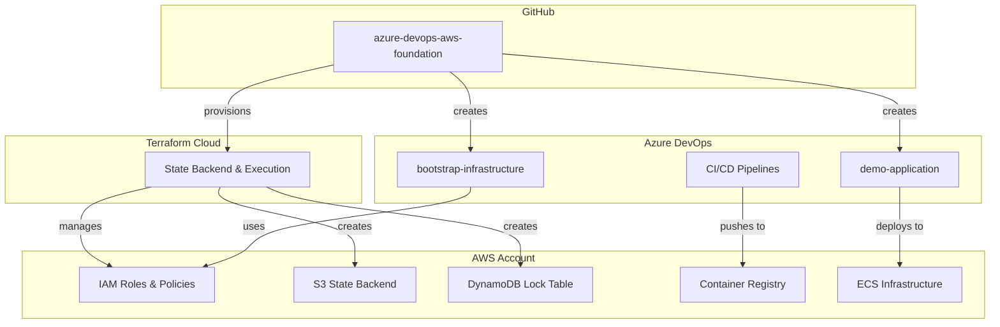

# Azure DevOps + AWS Foundation

Infrastructure-as-Code foundation for demonstrating enterprise-grade CI/CD patterns using Azure DevOps pipelines with AWS infrastructure deployment.

## Overview

This project automates the complete setup of cloud accounts and foundational infrastructure needed for a sophisticated CI/CD demonstration. It provisions AWS IAM roles, creates Azure DevOps projects, and establishes the security and networking foundation for containerized application deployment.

**Target Audience:** DevOps engineers, platform teams, and anyone needing reproducible multi-cloud account setup for CI/CD demonstrations or proof-of-concepts.

## Architecture

### Repository Strategy

This foundation enables a three-repository approach that mirrors enterprise patterns:

```
┌─────────────────────────────────────────────────────────────┐
│                    Repository Responsibilities                │
├─────────────────────────────────────────────────────────────┤
│ 1. azure-devops-aws-foundation (this repo)                   │
│    • Account provisioning and IAM setup                      │
│    • Azure DevOps organization/project creation              │
│    • Terraform state backend initialization                  │
│    • One-time foundation setup                               │
├─────────────────────────────────────────────────────────────┤
│ 2. bootstrap-infrastructure (Azure DevOps)                   │
│    • Team member access and permissions                      │
│    • Shared Terraform modules                                │
│    • Security baseline (CloudTrail, Config)                  │
│    • Per-project foundation setup                            │
├─────────────────────────────────────────────────────────────┤
│ 3. demo-application (Azure DevOps)                           │
│    • Application infrastructure (ECS, ALB, etc.)             │
│    • CI/CD pipelines with quality gates                      │
│    • Containerized application deployment                    │
│    • Ongoing development and delivery                        │
└─────────────────────────────────────────────────────────────┘
```

### System Architecture



### Security Model

**Cross-Platform Access:**
- Azure DevOps service principals with minimal AWS permissions
- IAM roles with trust relationships (no long-lived keys)
- Terraform Cloud workspace isolation
- Team-based access controls in Azure DevOps

**Credential Flow:**
1. Manual AWS admin user (temporary, for bootstrap only)
2. Creates IAM roles for Azure DevOps integration
3. Service connections use assumed roles
4. Deletes temporary admin user after setup

## Technical Decisions

### Infrastructure as Code
**Terraform** - Chosen over OpenTofu to align with target employer's technology stack and demonstrate HashiCorp ecosystem integration patterns (Terraform Cloud, enterprise features).

### State Management
**Terraform Cloud** - Provides secure remote state, team collaboration features, and enterprise-grade workflow patterns. Demonstrates understanding of production state management vs. local development.

### Repository Strategy
**Three-repository approach** - Separates concerns between account provisioning (one-time), infrastructure bootstrap (per-project), and application delivery (ongoing). Mirrors real enterprise patterns where platform teams manage foundation and application teams focus on delivery.

### Cloud Platforms
**AWS + Azure DevOps** - Matches target employer's hybrid approach. AWS for infrastructure, Azure DevOps for CI/CD pipeline sophistication.

### Development Workflow
**just + direnv + .env pattern** - Provides consistent, documented automation while maintaining secure credential handling and environment isolation.

## Prerequisites

### Required Tools
- [just](https://just.systems/) - Command runner for automation
- [direnv](https://direnv.net/) - Environment variable management
- [Terraform](https://terraform.io/) - Infrastructure as Code
- [AWS CLI](https://aws.amazon.com/cli/) - AWS command line interface

### Required Accounts
- **AWS Account** - Fresh account recommended for isolation
- **Azure DevOps** - Free tier sufficient
- **Terraform Cloud** - Free tier sufficient

### Installation

```bash
# macOS with Homebrew
brew install just direnv terraform awscli

# Enable direnv in your shell
echo 'eval "$(direnv hook bash)"' >> ~/.bashrc  # or ~/.zshrc
```

## Quick Start

### 1. Environment Setup

```bash
# Clone repository
git clone https://github.com/yourusername/azure-devops-aws-foundation
cd azure-devops-aws-foundation

# Copy and configure environment variables
cp .env.local.example .env.local
# Edit .env.local with your values

# Load environment (direnv will prompt for approval)
direnv allow
```

### 2. Account Configuration

**AWS Account:**
1. Create new AWS account
2. Create IAM user with admin permissions
3. Generate access keys
4. Add credentials to `.env.local`

**Azure DevOps:**
1. Create Azure DevOps organization
2. Generate Personal Access Token (full access)
3. Add organization URL and PAT to `.env.local`

**Terraform Cloud:**
1. Create account at app.terraform.io
2. Create organization and workspace
3. Connect workspace to this GitHub repository
4. Add AWS and Azure DevOps credentials as environment variables

### 3. Provisioning

```bash
# Validate configuration
just validate

# Run complete bootstrap process
just bootstrap

# Verify setup
just status
```

## Available Commands

### Core Operations

```bash
just validate          # Validate Terraform configuration
just plan              # Show planned infrastructure changes  
just bootstrap         # Complete account provisioning
just status            # Show current infrastructure status
just clean             # Destroy all infrastructure
```

### Development Workflow

```bash
just format            # Format Terraform code
just lint              # Lint configuration files
just docs              # Generate/update documentation
just test              # Run validation tests
```

### Troubleshooting

```bash
just logs              # Show Terraform Cloud execution logs
just debug             # Enable debug mode for next operation
just reset             # Reset local Terraform state
```

## Implementation Plan

### Phase 0: Foundation Setup (30 minutes)

**Objectives:**
- Establish Terraform Cloud workspace
- Create AWS IAM infrastructure
- Bootstrap Azure DevOps projects
- Verify cross-platform connectivity

**Deliverables:**
- Working Terraform Cloud integration
- AWS service roles for Azure DevOps
- Two Azure DevOps projects created
- S3 + DynamoDB state backend

**Success Criteria:**
- `just status` shows healthy infrastructure
- Azure DevOps can assume AWS roles
- Terraform state stored securely in cloud

### Phase 1: Application Foundation (45 minutes)

**Objectives:**
- Deploy core AWS networking (VPC, subnets, NAT)
- Create ECS cluster and ALB infrastructure
- Establish container registry (ECR)
- Configure SSL certificates and DNS

**Deliverables:**
- Production-ready networking foundation
- Container orchestration platform
- HTTPS-enabled load balancer
- Shared Terraform modules

**Success Criteria:**
- ALB health checks pass
- ECR repositories accessible
- SSL certificates valid
- Modules reusable across environments

### Phase 2: CI/CD Pipeline (60 minutes)

**Objectives:**
- Create sophisticated Azure DevOps pipelines
- Implement security scanning and quality gates
- Configure multi-environment deployment flow
- Add approval workflows and notifications

**Deliverables:**
- Multi-stage deployment pipelines
- Container vulnerability scanning
- Infrastructure security validation
- Email-based approval workflows

**Success Criteria:**
- Pipelines deploy successfully
- Security gates function correctly
- Rollback procedures operational
- Team notifications working

### Phase 3: Application Deployment (45 minutes)

**Objectives:**
- Deploy containerized Next.js application
- Implement health checks and monitoring
- Configure semantic versioning workflow
- Validate end-to-end functionality

**Deliverables:**
- Working web application
- Immutable container tagging
- Blue-green deployment capability
- Integration test automation

**Success Criteria:**
- Application accessible via HTTPS
- Health endpoints responding
- Version management functional
- Automated deployment working

### Phase 4: Advanced Features (time permitting)

**Objectives:**
- Integrate AWS Secrets Manager
- Add deployment history tracking
- Implement advanced monitoring
- Polish documentation and demo flow

**Deliverables:**
- 12-factor configuration management
- Operational dashboards
- Comprehensive documentation
- Demo script and video

**Success Criteria:**
- Secrets managed securely
- Observability complete
- Demo ready for presentation
- Documentation professional-grade

## Project Outputs

### Repository Structure
```
azure-devops-aws-foundation/
├── .envrc                     # direnv configuration
├── .env.local.example         # Environment template
├── .gitignore                 # Excludes sensitive files
├── justfile                   # Automation commands
├── README.md                  # This file
├── terraform/
│   ├── main.tf               # Main configuration
│   ├── variables.tf          # Input variables
│   ├── outputs.tf            # Output values
│   ├── aws-iam.tf           # AWS IAM roles and policies
│   ├── azure-devops.tf      # Azure DevOps project creation
│   └── state-backend.tf     # S3 + DynamoDB setup
├── scripts/
│   ├── setup-azure-devops.sh # Azure DevOps automation
│   └── verify-setup.sh       # Post-deployment validation
└── docs/
    ├── troubleshooting.md     # Common issues and solutions
    └── architecture.md        # Detailed system design
```

### Generated Resources

**AWS Infrastructure:**
- IAM roles for Azure DevOps service connections
- S3 bucket for Terraform state storage
- DynamoDB table for state locking
- ECR repositories for container images
- VPC with public/private subnets

**Azure DevOps Projects:**
- `bootstrap-infrastructure` - Shared modules and team setup
- `demo-application` - Application delivery and CI/CD

**Access Management:**
- Team member invitations with role-based permissions
- Service connections for AWS integration
- Variable groups for environment configuration

## Cleanup and Teardown

### Graceful Cleanup (Preserves Accounts)
```bash
# Destroy infrastructure in reverse order
just clean

# Remove service connections manually in Azure DevOps
# Revoke Personal Access Tokens
# Delete IAM users and roles
```

### Nuclear Option (Recommended for Demo)
```bash
# Close AWS account (billing stops immediately)
# Delete Azure DevOps organization
# Delete Terraform Cloud workspace
# Total cleanup with zero residual costs
```

## Platform Engineering Potential

This foundation demonstrates patterns that scale to enterprise self-service developer platforms:

### Template-Driven Project Generation
- **Repository templates** - Bootstrap patterns become project scaffolding
- **Parameter-driven customization** - Environment variables and Terraform vars enable project variants
- **AI-assisted documentation** - Automated README generation based on infrastructure choices

### Reusable Platform Components
- **Shared module library** - Common infrastructure patterns as consumable modules
- **Standard security baselines** - Consistent security and compliance across projects
- **Integrated observability** - Monitoring and logging patterns baked into templates

### Developer Self-Service Workflows
- **Prompt-driven infrastructure** - "Create a new microservice with Redis and PostgreSQL"
- **Automated compliance** - Security scanning and policy enforcement in templates
- **Environment management** - Standardized dev/staging/prod promotion workflows

### Scaling Considerations
- **Multi-account strategies** - This pattern extends to account vending machines
- **Cross-platform integration** - Azure DevOps + AWS model applies to other cloud providers
- **GitOps at scale** - Repository-per-service with shared pipeline templates

## Next Steps

After successful provisioning:

1. **Clone generated Azure DevOps repositories**
2. **Follow bootstrap-infrastructure setup guide**
3. **Deploy demo application using provided pipelines**
4. **Customize for your specific use case**
5. **Explore platform engineering extensions** - Consider how patterns could scale to self-service developer platforms

## Troubleshooting

### Common Issues

**Terraform Cloud Authentication:**
```bash
terraform login
# Follow prompts to generate API token
```

**AWS Credential Issues:**
```bash
aws sts get-caller-identity
# Verify your AWS credentials are working
```

**Azure DevOps PAT Problems:**
```bash
# Ensure PAT has full access scope
# Check organization URL format: https://dev.azure.com/yourorg
```

**State Lock Conflicts:**
```bash
just reset
# This will break state locks and reinitialize
```

### Support

- **Documentation:** See `docs/` directory for detailed guides
- **Issues:** Use GitHub issues for bug reports and feature requests
- **Architecture:** Review `docs/architecture.md` for system design details

---

**Development Approach:**
- Infrastructure code and implementation written manually for learning and technical authenticity
- Documentation and planning materials created with AI assistance for efficiency and consistency
- All architectural decisions and technical choices are original and considered

**Created for demonstrating enterprise CI/CD patterns with Azure DevOps and AWS infrastructure.**